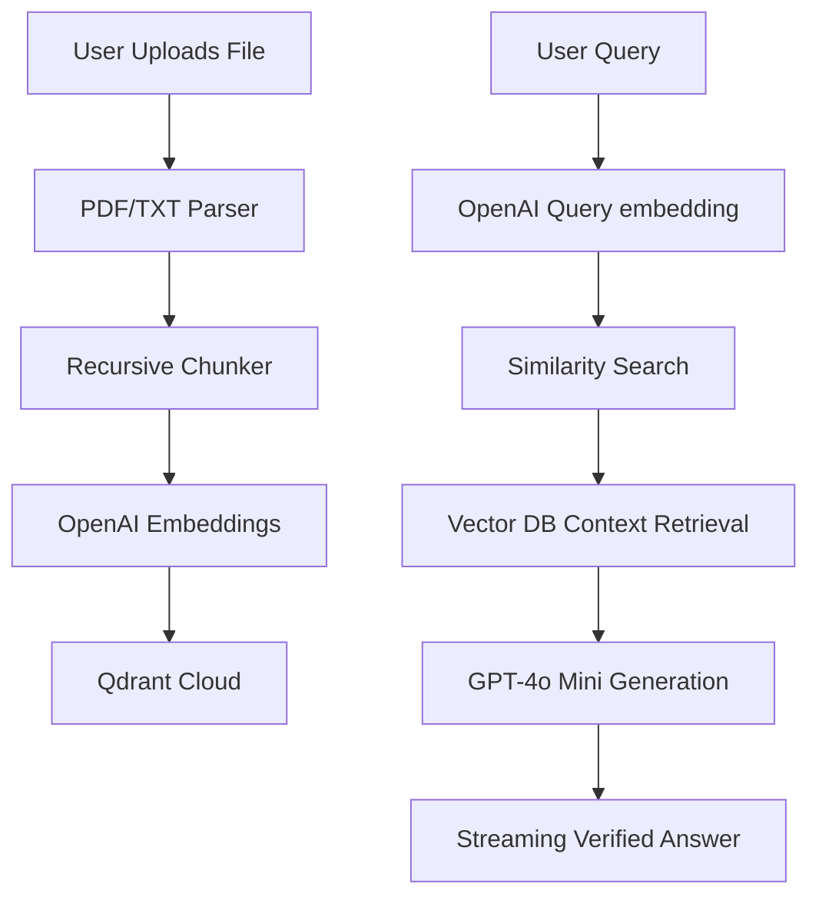

# DocGlow AI

> A premium, cinematic NotebookLM-style RAG application — upload documents, chat with them using grounded AI answers with source-cited facts.


---

## ✨ Features

- **Document Intelligence** — Drag & drop PDF or TXT files with real-time extraction and indexing.
- **Cinematic UI/UX** — Immersive glassmorphism, animated gradients, and high-fidelity micro-interactions.
- **3D Hero Scene** — Interactive Three.js particle galaxy with mouse tracking and holographic orbs.
- **Full RAG Pipeline** — Automatic parsing, recursive chunking, vector embedding, and similarity retrieval.
- **Verified Answers** — AI responses are strictly grounded in your documents with precise source citations.
- **Streaming Chat** — Real-time response streaming with full Markdown support and code highlighting.
- **Mobile Responsive** — Optimized experience across all screen sizes with adaptive layouts.

---

## 🏗️ Architecture



---

## 🚀 Quick Start

### Prerequisites

- Node.js 18+
- OpenAI API Key
- Qdrant Cloud Cluster (Free tier works perfectly)

### 1. Clone & Install

```bash
git clone https://github.com/your-repo/docglow-ai-rag.git
cd docglow-ai-rag
npm install
```

### 2. Configure Environment

Create a `.env.local` file in the root directory:

```env
OPENAI_API_KEY=sk-...
QDRANT_URL=https://your-cluster.qdrant.io:6333
QDRANT_API_KEY=your-qdrant-api-key
```

### 3. Run Development Server

```bash
npm run dev
```

Open [http://localhost:3000](http://localhost:3000) to experience DocGlow AI.

---

## 📁 Project Structure

```
src/
├── app/
│   ├── api/                  # Backend endpoints (Upload, Chat)
│   ├── page.tsx              # Unified landing & dashboard
│   └── globals.css           # Cinematic design system & animations
├── components/
│   ├── hero-3d.tsx           # Three.js galaxy scene
│   ├── upload-zone.tsx       # Animated document ingestor
│   ├── chat-panel.tsx        # Immersive chat interface
│   └── sidebar.tsx           # Document metadata & info
├── lib/
│   ├── rag.ts                # RAG pipeline orchestration
│   ├── embeddings.ts         # OpenAI embedding integration
│   ├── qdrant.ts             # Vector database management
│   └── prompts.ts            # System instructions for grounding
└── types/                    # Unified type definitions
```

---

## 🧠 RAG Strategy

### Ingestion Pipeline
- **Chunking**: `RecursiveCharacterTextSplitter` (1000 chars, 200 overlap) for context preservation.
- **Embeddings**: `text-embedding-3-small` (1536-dimensional vectors) for high performance.
- **Vector Storage**: Qdrant Cloud with payload metadata including chunk index and file info.

### Retrieval & Generation
- **Search**: Cosine similarity retrieval (Top 5 chunks per query).
- **Security**: Namespace isolation via `documentId` filtering.
- **Model**: `gpt-4o-mini` with a temperature of `0.1` for maximum factual accuracy.
- **Grounding**: Strict system prompt instructions to prevent hallucinations.

---

## 🌐 Deployment

DocGlow AI is optimized for Vercel deployment:

1. Push your code to GitHub.
2. Import project to Vercel.
3. Configure `OPENAI_API_KEY`, `QDRANT_URL`, and `QDRANT_API_KEY` in Environment Variables.
4. Deploy!

---

## 📄 License

MIT

---

Built with ❤️ by the DocGlow AI Team.
